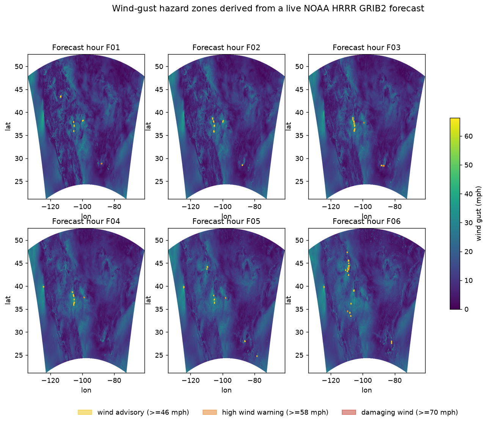

# Wind-Gust Hazard Pipeline — a working demo

A small but **end-to-end** pipeline that ingests a GRIB2 weather forecast,
stages it in cloud-native formats, and turns it into **attributed hazard
warning polygons** ready for PostGIS and MapLibre.

I built this to get hands-on with the geospatial raster side of the platform —
NetCDF, GRIB2, and Zarr — and to show how that data flows from a model cycle all
the way to something an operator (or an incident system) can act on.

**Live demo:** https://hazard-pipeline-demo.vercel.app

```
 GRIB2 forecast ──► xarray/cfgrib ──► NetCDF + Zarr (S3-style chunks)
                                              │
                                              ▼
                      threshold ──► polygonize ──► GeoJSON warning zones
                                              │
                                              ▼
                              PostGIS  +  MapLibre GL (vector)
```



## What it does

A gust front sweeps eastward across Oklahoma over six forecast hours. For each
hour the pipeline thresholds the 10 m wind-gust field into three hazard tiers
(advisory ≥46 mph, high-wind warning ≥58, damaging ≥70), vectorizes each tier
into polygons, and emits a single GeoJSON `FeatureCollection`. Every polygon
carries `hazard_class`, `peak_gust_mph`, `forecast_hour`, and `valid_time`, in
EPSG:4326 — so it `INSERT`s into a PostGIS geometry column and renders in
MapLibre with zero transformation.

Open **`index.html`** for an interactive console: a forecast-hour
scrubber animates the warning zones across the run, and an "About" panel on the
page summarizes what each pipeline stage does.

## Data source

The demo runs on **real NOAA data**. At build time it fetches the most recent
**HRRR** (3 km CONUS) surface wind-gust cycle from **NOMADS** (`fetch_hrrr.py`),
reads it through the exact `xarray`/`cfgrib` path, persists NetCDF + Zarr,
thresholds and polygonizes with `rasterio`, and renders the result. The map you
see is whatever gusts NOAA's latest run is forecasting — the build auto-frames
wherever today's wind hazards actually are.

HRRR ships on a Lambert Conformal grid, so there is **one** adaptation versus a
plain regular-grid feed: a reprojection step (`regrid.py`) resamples the
curvilinear field onto a regular EPSG:4326 grid by max-binning (the right
reducer for a hazard product — it never washes out a peak gust). Everything
downstream of ingest is unchanged.

`generate_forecast.py` — which encodes a synthetic gust front as genuine GRIB2
via ecCodes — is kept as an **offline fallback**: if NOMADS is unreachable, the
pipeline still produces output (`source="synthetic"` forces it, `"hrrr"`
requires live data, `"auto"` is the default).

## How it maps to the platform stack

| Platform piece            | What this demo exercises                                  |
|---------------------------|-----------------------------------------------------------|
| GRIB2 / NetCDF / Zarr     | all three written and read; one `xarray` model across them |
| "high volume & velocity"  | Zarr chunked one-object-per-forecast-hour for cheap partial reads on S3 |
| PostgreSQL + PostGIS      | GeoJSON polygons in EPSG:4326, attribute-tagged, ready to insert |
| MapLibre GL + vanilla JS  | `output/index.html` renders the output directly, no build step |
| Python ingest/processing  | `xarray`, `cfgrib`, `rasterio`, `shapely`, `dask`         |
| AWS S3                    | Zarr object layout mirrors an S3 key structure            |

## Run it

`cfgrib` needs the **ecCodes C library** (the Python package only provides
bindings). On macOS: `brew install eccodes`; on Debian/Ubuntu:
`apt-get install libeccodes0`. `run.sh` auto-detects a Homebrew install and
points `ECCODES_DIR` at it.

```bash
pip install -r requirements.txt
./run.sh
# then open index.html  (needs network — fetches the latest live HRRR cycle)
```

Or step by step:

```bash
python3 -m hazpipe.pipeline        # GRIB2 -> NetCDF + Zarr -> warnings.geojson
python3 -m hazpipe.render_preview  # static PNG (hazard_preview.png)
python3 -m hazpipe.build_map_demo  # interactive MapLibre page (index.html)
```

## Layout

```
index.html               deployable MapLibre console (Vercel serves this)
warnings.geojson         pipeline output (PostGIS / MapLibre ready)
hazard_preview.png       static preview montage
vercel.json              zero-build static deploy config
hazpipe/
  fetch_hrrr.py          live HRRR gust from NOAA NOMADS  (the real source)
  generate_forecast.py   synthetic forecast -> real GRIB2  (offline fallback)
  regrid.py              HRRR Lambert grid -> regular EPSG:4326 (max-binning)
  ingest.py              GRIB2 -> clean xarray Dataset
  store.py               NetCDF archive + cloud-native Zarr (chunking strategy)
  hazard.py              threshold -> polygonize -> attributed GeoJSON
  pipeline.py            orchestrates one forecast cycle (idempotent)
  render_preview.py      static map montage
  build_map_demo.py      bakes GeoJSON into the MapLibre console
data/                    GRIB2 / NetCDF / Zarr artifacts (gitignored, regenerable)
```

## Deploy (Vercel)

The site is static — `index.html` has the GeoJSON inlined, so there's no build
step and no server. Vercel just serves the repo root.

1. Push this repo to GitHub.
2. In Vercel, **Add New → Project → Import** the GitHub repo.
3. Framework preset: **Other**. Build command: _none_. Output directory: _root_.
4. Deploy. The committed `index.html` is served as-is.

To refresh the data, run `./run.sh` locally and commit the regenerated
`index.html` / `warnings.geojson`.

## Notes toward production

A few things I'd carry into the real system, happy to talk through:

- **Vectorize on ingest, not in the browser.** Shipping rasters to the client
  doesn't scale; serving pre-derived vector warnings (or vector tiles) keeps the
  frontend fast and the warnings queryable in PostGIS.
- **Chunk to the access pattern.** Here it's one chunk per forecast hour because
  the dominant read is "the field for F03." Point-time-series access would chunk
  the other way; the right answer depends on how the platform reads.
- **Idempotent, per-cycle jobs.** Each model cycle is a self-contained run that
  overwrites its artifacts in place — safe to retry when a feed hiccups.
- **Polygon hygiene.** Real warnings want simplification, small-area filtering,
  and smoothing before they hit operators; the threshold→polygonize core is here,
  the cleanup is a known next layer.
